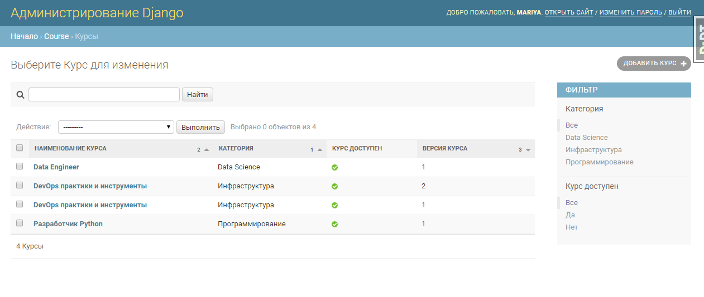

This is a 1st homework at Django learning project. 

There are some courses in diffrent caterogies (Programming, Data Science, DevOps, etc). Each course has a StudyPlan and a version control. Every CourseFlow has a study group, homework, timetable and StudentAcademicPerformance. 

Custom User model without username is used, authentication is made via phone_number. Each user can be a student or a teacher. 

Within this homework Django Models are created. 

Here are some examples of admin panel

Category of Courses

Courses 

StudyPlan for each Course 

Course Flows

Homeworks for Course Flows 

Students in each CourseFlow 

Students Academic Performance in each Course Flow

Timetable for each Course Flow

