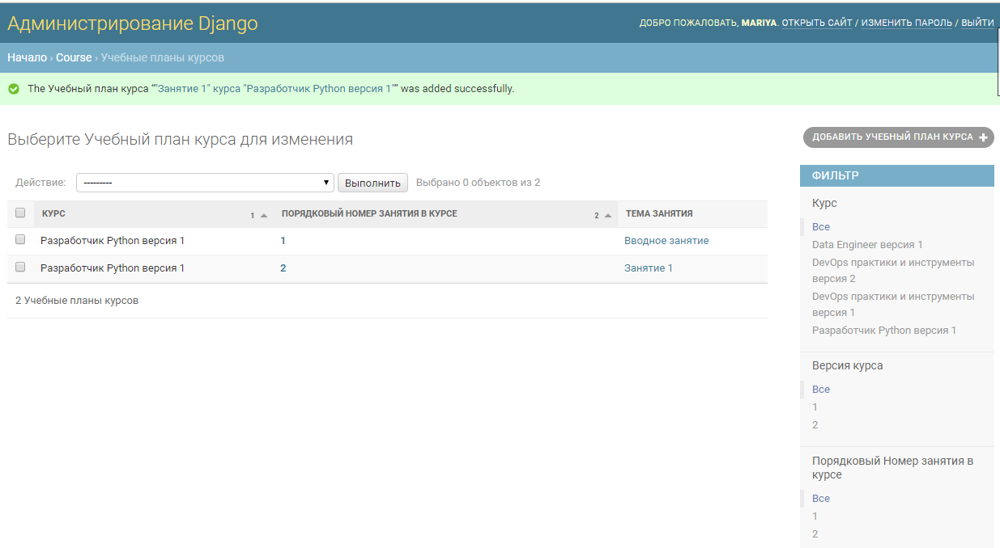
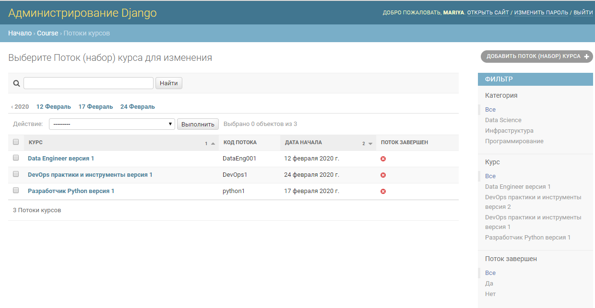
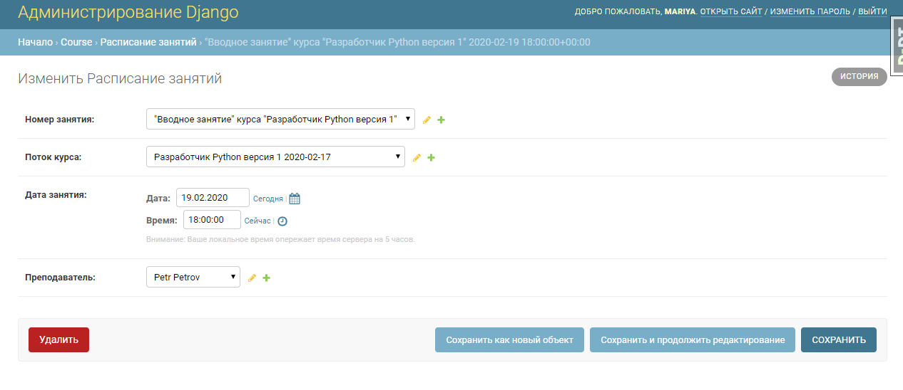

Django Models for learning platform. 

Nowadays consists of 2 apps:
- course
- user_profile

Custom model without username is used. 

Here are some examples of admin panel

Category of Courses

Courses 

StudyPlan for each Course 

Course Flows

Homeworks for Course Flows 

Students in each CourseFlow 

Students Academic Performance in each Course Flow

Timetable for each Course Flow

